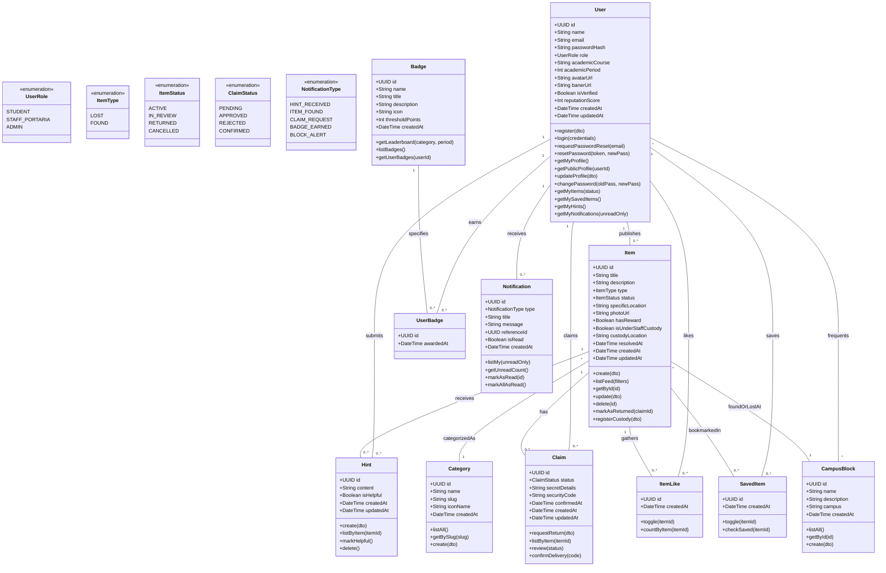

# Class Diagram & Domain Model Specification — Achei Unochapecó

Technical architecture and object-oriented class specifications for the **Achei Unochapecó** backend services, persistence layer, and Prisma ORM domain modeling. All classes, attributes, methods, and relationships are standardized in **English**.

---

## 1. Visual Class Diagram (Mermaid)

---

## 2. Descriptive Class Specifications

### 2.1 `User`
Represents an academic member of Unochapecó (student, staff/security/custody, or admin).

* **Attributes:**
  * `id: UUID` — Unique identifier.
  * `name: String` — User's full academic name.
  * `email: String (Unique)` — Institutional email address (must end with `@unochapeco.edu.br`).
  * `passwordHash: String` — Salted and hashed password (`bcrypt`).
  * `role: UserRole` — Enum (`STUDENT`, `STAFF_PORTARIA`, `ADMIN`).
  * `academicCourse: String?` — Undergraduate or graduate course (e.g., "Computer Science", "Law").
  * `academicPeriod: Int?` — Current semester/period (1 to 12).
  * `frequentedBlocks: CampusBlock[]` — Many-to-many relation with campus blocks the user frequents for personalized alerts and timeline filtering.
  * `avatarUrl: String?` — Profile picture storage URL.
  * `banerUrl: String?` — Profile cover banner image storage URL (`banerUrl`).
  * `isVerified: Boolean` — True once institutional domain email validation is complete.
  * `reputationScore: Int` — Accumulated community karma points from returns, finds, and helpful hints.
  * `createdAt: DateTime` — Record creation timestamp.
  * `updatedAt: DateTime` — Last profile update timestamp.
* **Responsibilities & Methods (API Routes & Use Cases):**

  | Method | HTTP Route | Access | Use Case / Description |
  | :--- | :--- | :--- | :--- |
  | `register(dto)` | `POST /api/auth/register` | Public | Registers a new academic user with mandatory `@unochapeco.edu.br` email, hashing passwords with bcrypt. |
  | `login(credentials)` | `POST /api/auth/login` | Public | Validates email/password credentials and generates an authenticated JWT session token. |
  | `requestPasswordReset(email)` | `POST /api/auth/forgot-password` | Public | Generates a secure, 30-minute valid reset token sent to the institutional inbox. |
  | `resetPassword(token, newPass)` | `POST /api/auth/reset-password` | Public | Replaces the password hash when a valid reset token is provided. |
  | `getMyProfile()` | `GET /api/users/me` | Authenticated | Retrieves current authenticated user profile, karma reputation, unlocked badges, and frequented campus blocks. |
  | `getPublicProfile(userId)` | `GET /api/users/:id` | Authenticated | Retrieves another student's public card (academic course, badges, karma score, active posts). |
  | `updateProfile(dto)` | `PUT /api/users/me` | Authenticated | Updates course, period, avatar image (`avatarUrl`), profile cover banner (`banerUrl`), and frequented campus blocks (`frequentedBlocks`). |
  | `changePassword(oldPass, newPass)` | `PATCH /api/users/me/password` | Authenticated | Verifies old password and commits new password hash. |
  | `getMyItems(status?)` | `GET /api/users/me/items` | Authenticated | Lists all lost and found publications authored by the current user, filterable by active or resolved status. |
  | `getMySavedItems()` | `GET /api/users/me/saved` | Authenticated | Lists all publications bookmarked by the user for tracking. |
  | `getMyHints()` | `GET /api/users/me/hints` | Authenticated | Lists all clues and hints contributed by the user, highlighting those marked as helpful. |
  | `getMyNotifications(unreadOnly?)` | `GET /api/users/me/notifications` | Authenticated | Retrieves user notifications (new hints on owned posts, claim status updates, new items found in frequented blocks). |

---

### 2.2 `Item`
Represents a reported lost or found belonging posted on the campus timeline feed.

* **Attributes:**
  * `id: UUID` — Unique identifier.
  * `title: String` — Short title of the item (e.g., "Dell Laptop in Blue Backpack").
  * `description: String` — Thorough description of the item and circumstances.
  * `type: ItemType` — Enum (`LOST` for lost items, `FOUND` for found items).
  * `status: ItemStatus` — Enum (`ACTIVE`, `IN_REVIEW`, `RETURNED`, `CANCELLED`).
  * `categoryId: UUID` — Foreign key referencing `Category`.
  * `blockId: UUID` — Foreign key referencing `CampusBlock`.
  * `specificLocation: String?` — Optional detailed location (e.g., "Lab 03 - 2nd Floor").
  * `photoUrl: String?` — Uploaded photo image URL.
  * `hasReward: Boolean` — Indicates if the owner offers an optional moral reward or gratitude.
  * `isUnderStaffCustody: Boolean` — True if item was physically surrendered to a security booth or desk.
  * `custodyLocation: String?` — Specifies the exact desk/booth (e.g., "Block G Reception Booth").
  * `authorId: UUID` — Foreign key to `User` who posted the item.
  * `resolvedAt: DateTime?` — Timestamp when item was officially delivered and marked `RETURNED`.
  * `resolvedById: UUID?` — Foreign key to `User` who helped resolve or confirmed the handoff.
  * `createdAt: DateTime` — Timestamp of publication.
  * `updatedAt: DateTime` — Timestamp of last modification.
* **Responsibilities & Methods (API Routes & Use Cases):**

  | Method | HTTP Route | Access | Use Case / Description |
  | :--- | :--- | :--- | :--- |
  | `create(dto)` | `POST /api/items` | Authenticated | Creates a new post for a lost or found belonging with title, description, category, campus block, specific location, photo, and optional moral reward. |
  | `listFeed(filters)` | `GET /api/items` | Public | Lists active items for the social feed with pagination and filters by type (`LOST`/`FOUND`), campus block, category, search keywords, and custody flag. |
  | `getById(id)` | `GET /api/items/:id` | Public | Returns full details of a single post, author summary, category, block, photos, helpful clues, and total likes. |
  | `update(dto)` | `PUT /api/items/:id` | Author / Admin | Edits post details (description, specific location, category) before the item is resolved. |
  | `delete(id)` | `DELETE /api/items/:id` | Author / Admin | Cancels and removes the item publication from the campus feed. |
  | `markAsReturned(claimId?)` | `PATCH /api/items/:id/return` | Author / Staff | Concludes the case, transitioning status to `RETURNED`, locking new hints, and awarding community karma points. |
  | `registerCustody(dto)` | `PATCH /api/items/:id/custody` | Staff / Admin | Flags that the item was physically surrendered to a security desk or portaria booth (`isUnderStaffCustody = true`). |
  | `listCustodyItems(blockId?)` | `GET /api/items/custody` | Staff / Admin | Lists all physical items currently stored in campus security/portaria lockers. |

---

### 2.3 `Category`
Master reference table organizing types of belongings.

* **Attributes:**
  * `id: UUID` — Unique identifier.
  * `name: String` — Name in Portuguese (e.g., "Eletrônicos", "Documentos", "Chaves").
  * `slug: String (Unique)` — URL-friendly slug (`electronics`, `documents`, `keys`, `books`, `clothing`, `other`).
  * `iconName: String` — Boxicons v2 CSS icon token (e.g., `bx-devices`, `bx-id-card`, `bx-key`).
  * `createdAt: DateTime` — Creation timestamp.
* **Responsibilities & Methods (API Routes & Use Cases):**

  | Method | HTTP Route | Access | Use Case / Description |
  | :--- | :--- | :--- | :--- |
  | `listAll()` | `GET /api/categories` | Public | Lists all master item categories with their Portuguese names, slugs, and Boxicons CSS classes for navigation chips and filters. |
  | `getBySlug(slug)` | `GET /api/categories/:slug` | Public | Retrieves specific category details and count of active lost/found items. |
  | `create(dto)` | `POST /api/categories` | Admin | Registers a new item category (e.g., Electronics, Documents, Keys). |
  | `update(id, dto)` | `PUT /api/categories/:id` | Admin | Updates category title, slug, or icon token. |
  | `delete(id)` | `DELETE /api/categories/:id` | Admin | Removes category if no active items depend on it. |

---

### 2.4 `CampusBlock`
Represents official physical buildings and blocks at Unochapecó campus.

* **Attributes:**
  * `id: UUID` — Unique identifier.
  * `name: String` — Official block identifier (e.g., "Bloco R", "Bloco G", "Biblioteca Central").
  * `description: String?` — Description of faculties and facilities housed (e.g., "Informatics & Labs").
  * `campus: String` — Campus name (default: "Campus Chapecó - Sede").
  * `frequentingUsers: User[]` — Many-to-many relationship with users who frequent this block.
  * `createdAt: DateTime` — Creation timestamp.
* **Responsibilities & Methods (API Routes & Use Cases):**

  | Method | HTTP Route | Access | Use Case / Description |
  | :--- | :--- | :--- | :--- |
  | `listAll()` | `GET /api/blocks` | Public | Lists all official campus buildings and locations (Bloco R, Bloco G, Biblioteca Central, Cantina Central, etc.) for timeline filtering and post forms. |
  | `getById(id)` | `GET /api/blocks/:id` | Public | Retrieves block metadata, description of facilities/labs, and recent items lost/found in it. |
  | `create(dto)` | `POST /api/blocks` | Admin | Registers a new campus building, lab pavilion, or physical reference point. |
  | `update(id, dto)` | `PUT /api/blocks/:id` | Admin | Edits block name, description, or campus sector. |
  | `delete(id)` | `DELETE /api/blocks/:id` | Admin | Deactivates or removes a campus block. |

---

### 2.5 `Hint`
Represents a community crowd-sourced clue left on a publication to help locate an item.

* **Attributes:**
  * `id: UUID` — Unique identifier.
  * `content: String` — Clue details (e.g., "I saw professor Carlos storing it in the room 204 cabinet!").
  * `isHelpful: Boolean` — Marked `true` by item author when the clue directly led to recovery.
  * `itemId: UUID` — Foreign key to `Item`.
  * `authorId: UUID` — Foreign key to `User`.
  * `createdAt: DateTime` — Creation timestamp.
  * `updatedAt: DateTime` — Timestamp of last edit.
* **Responsibilities & Methods (API Routes & Use Cases):**

  | Method | HTTP Route | Access | Use Case / Description |
  | :--- | :--- | :--- | :--- |
  | `create(dto)` | `POST /api/items/:itemId/hints` | Authenticated | Submits a clue/comment on a post indicating where the item was seen or who may have it, alerting the post author. |
  | `listByItem(itemId)` | `GET /api/items/:itemId/hints` | Public | Retrieves chronological list of community clues left on a publication. |
  | `markHelpful()` | `PATCH /api/hints/:id/helpful` | Item Author | Post author flags a specific clue as "Pista Útil", awarding +2 reputation points to the clue's creator. |
  | `delete()` | `DELETE /api/hints/:id` | Hint Author / Admin | Deletes own clue from discussion. |

---

### 2.6 `Claim`
Represents a formal ownership retrieval claim or return validation request.

* **Attributes:**
  * `id: UUID` — Unique identifier.
  * `itemId: UUID` — Foreign key to `Item`.
  * `claimantId: UUID` — Foreign key to `User` making the claim.
  * `status: ClaimStatus` — Enum (`PENDING`, `APPROVED`, `REJECTED`, `CONFIRMED`).
  * `secretDetails: String?` — Private details submitted by claimant to prove ownership without public disclosure.
  * `securityCode: String?` — 6-digit confirmation code generated to authorize booth/staff handoff.
  * `confirmedAt: DateTime?` — Timestamp of final handoff confirmation.
  * `createdAt: DateTime` — Claim creation timestamp.
  * `updatedAt: DateTime` — Last state update timestamp.
* **Responsibilities & Methods (API Routes & Use Cases):**

  | Method | HTTP Route | Access | Use Case / Description |
  | :--- | :--- | :--- | :--- |
  | `requestReturn(dto)` | `POST /api/items/:itemId/claims` | Authenticated | Submits formal ownership claim with confidential secret details (e.g., private markings, serial, lockscreen wallpaper). |
  | `listByItem(itemId)` | `GET /api/items/:itemId/claims` | Author / Staff | Lists all pending and historical claims submitted for an item. |
  | `getById(id)` | `GET /api/claims/:id` | Claimant / Author / Staff | Retrieves detailed claim status, secret proof, and the handoff PIN code. |
  | `review(status)` | `PATCH /api/claims/:id/review` | Author / Staff | Approves (`APPROVED`) or rejects (`REJECTED`) the claim after verifying secret details. Generates 6-digit confirmation code on approval. |
  | `confirmDelivery(code)` | `POST /api/claims/:id/confirm` | Author / Staff | Validates the claimant's 6-digit PIN code upon physical delivery, marking claim as `CONFIRMED` and item as `RETURNED`. |

---

### 2.7 `ItemLike` & `SavedItem`
Join-table entities representing user social engagement and personal bookmarks.

* **Attributes:**
  * **`ItemLike`:** `id: UUID`, `itemId: UUID`, `userId: UUID`, `createdAt: DateTime`
  * **`SavedItem`:** `id: UUID`, `itemId: UUID`, `userId: UUID`, `createdAt: DateTime`
* **Responsibilities & Methods (API Routes & Use Cases):**

  | Method | HTTP Route | Access | Use Case / Description |
  | :--- | :--- | :--- | :--- |
  | `toggleLike(itemId)` | `POST /api/items/:itemId/like` | Authenticated | Toggles community endorsement/like on an item post to increase feed visibility and relevance. |
  | `getItemLikes(itemId)` | `GET /api/items/:itemId/likes` | Public | Returns total like counter and a boolean flag indicating whether the authenticated user has liked the post. |
  | `toggleSave(itemId)` | `POST /api/items/:itemId/save` | Authenticated | Bookmarks or removes an item from the user's personal "Itens Salvos" collection for tracking. |
  | `checkSaved(itemId)` | `GET /api/items/:itemId/is-saved` | Authenticated | Verifies if the active user has bookmarked this item. |

---

### 2.8 `Badge` & `UserBadge`
Gamification model tracking milestones, reputational ranks, and achievement unlocks.

* **Attributes:**
  * **`Badge`:** `id: UUID`, `name: String (Unique)`, `title: String`, `description: String`, `icon: String`, `thresholdPoints: Int`, `createdAt: DateTime`
  * **`UserBadge`:** `id: UUID`, `userId: UUID`, `badgeId: UUID`, `awardedAt: DateTime`
* **Responsibilities & Methods (API Routes & Use Cases):**

  | Method | HTTP Route | Access | Use Case / Description |
  | :--- | :--- | :--- | :--- |
  | `getLeaderboard(category, period)` | `GET /api/rankings` | Public | Computes and returns campus leaderboard filtered by category (`MOST_RETURNED`, `MOST_FOUND`, `MOST_LOST`) and period (`MONTH`, `SEMESTER`, `ALL_TIME`). |
  | `getMyRankPosition(category)` | `GET /api/rankings/me` | Authenticated | Retrieves current student's standing, karma points, and relative position in the university leaderboard. |
  | `listBadges()` | `GET /api/badges` | Public | Lists all available system badges (*Guardião de Ouro*, *Detetive de Pistas*, *Rei da Distração*) with required karma thresholds. |
  | `getUserBadges(userId)` | `GET /api/users/:userId/badges` | Public | Returns all badges earned and unlocked by a specific academic user. |

---

### 2.9 `Notification`
Dispatches real-time or inbox alerts to users regarding clues, claims, and campus block feeds.

* **Attributes:**
  * `id: UUID` — Unique identifier.
  * `userId: UUID` — Recipient user ID.
  * `type: NotificationType` — Enum (`HINT_RECEIVED`, `ITEM_FOUND`, `CLAIM_REQUEST`, `BADGE_EARNED`, `BLOCK_ALERT`).
  * `title: String` — Alert headline.
  * `message: String` — Detailed message.
  * `referenceId: UUID?` — Target entity ID (Item ID or Claim ID) for deep-linking.
  * `isRead: Boolean` — Read state (default: false).
  * `createdAt: DateTime` — Timestamp.
* **Responsibilities & Methods (API Routes & Use Cases):**

  | Method | HTTP Route | Access | Use Case / Description |
  | :--- | :--- | :--- | :--- |
  | `listMy(unreadOnly?)` | `GET /api/notifications` | Authenticated | Retrieves user's notifications feed with type indicators (hints, claims, block alerts). |
  | `getUnreadCount()` | `GET /api/notifications/unread-count` | Authenticated | Returns counter of unread alerts for the top navigation bell badge. |
  | `markAsRead(id)` | `PATCH /api/notifications/:id/read` | Recipient User | Marks single notification as read. |
  | `markAllAsRead()` | `PATCH /api/notifications/read-all` | Recipient User | Marks all pending notifications as read in bulk. |

---

## 3. Enumeration Reference

| Enum Name | Values | Description |
|---|---|---|
| `UserRole` | `STUDENT`, `STAFF_PORTARIA`, `ADMIN` | Role-based authorization levels across the platform. |
| `ItemType` | `LOST`, `FOUND` | Primary classification of the reported item. |
| `ItemStatus` | `ACTIVE`, `IN_REVIEW`, `RETURNED`, `CANCELLED` | Lifecycle state of a publication. |
| `ClaimStatus` | `PENDING`, `APPROVED`, `REJECTED`, `CONFIRMED` | Verification progression for returning an item. |
| `NotificationType` | `HINT_RECEIVED`, `ITEM_FOUND`, `CLAIM_REQUEST`, `BADGE_EARNED`, `BLOCK_ALERT` | Categorization of user alert dispatches. |

---

## 4. File & Media Storage Architecture (Cloudinary)

All media assets and user-uploaded images are processed, hosted, and delivered via **Cloudinary CDN**:

* **Target Fields & Managed Folders:**
  * `User.avatarUrl`: Stored under `achei-unochapeco/avatars/`. Transformed with auto-crop for faces (`c_thumb,g_face,w_200,h_200,f_auto,q_auto`).
  * `User.banerUrl`: Stored under `achei-unochapeco/banners/`. Transformed for responsive profile headers (`c_fill,w_1200,h_400,f_auto,q_auto`).
  * `Item.photoUrl`: Stored under `achei-unochapeco/items/`. Transformed with auto format and compression (`f_auto,q_auto,w_900`).
* **Backend Environment Variables (`backend/.env`):**
  * `CLOUDINARY_CLOUD_NAME` — Cloudinary account cloud name.
  * `CLOUDINARY_API_KEY` — API public identification key.
  * `CLOUDINARY_API_SECRET` — Secure signing secret.
* **Security & Delivery Rules:**
  * Only signed upload requests from authenticated users are permitted.
  * All served URLs utilize secure HTTPS protocol.
  * WebP and AVIF formats are automatically negotiated based on user's browser capabilities (`f_auto`).
